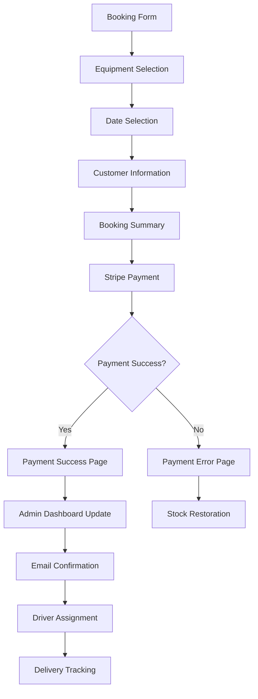
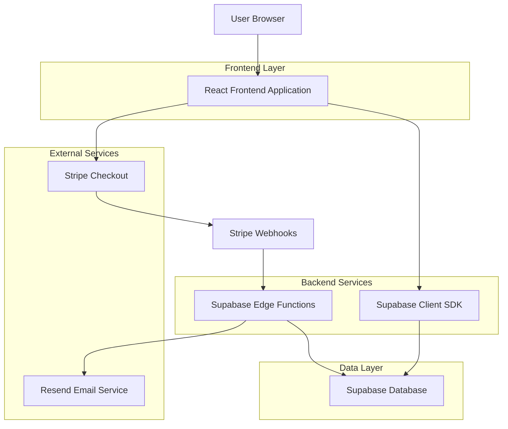
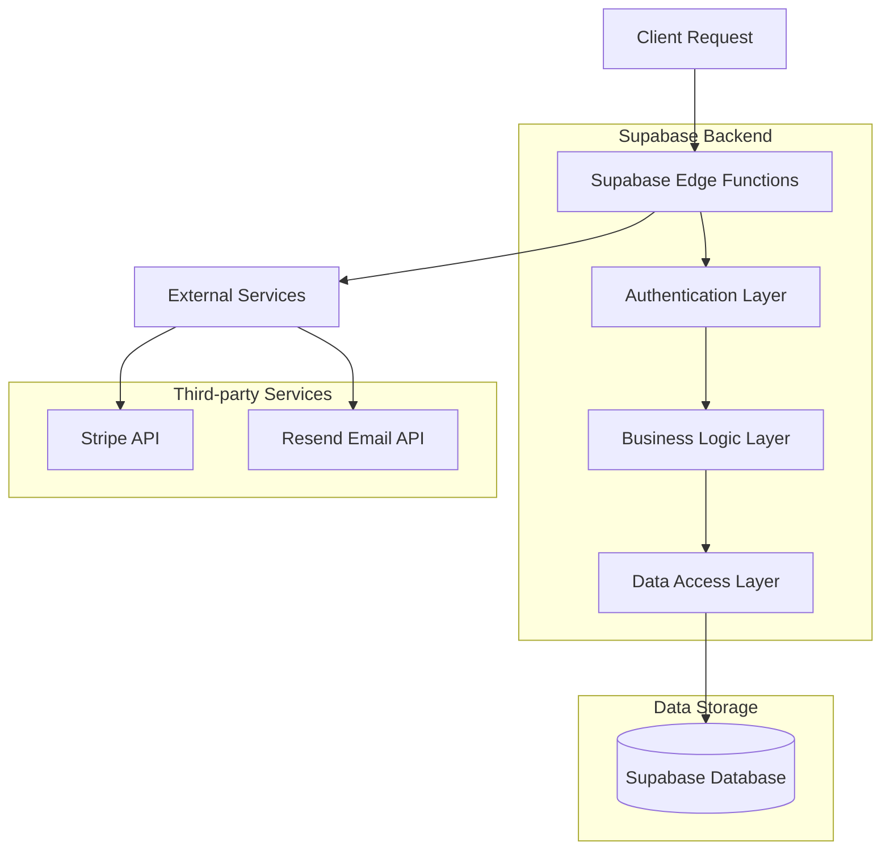
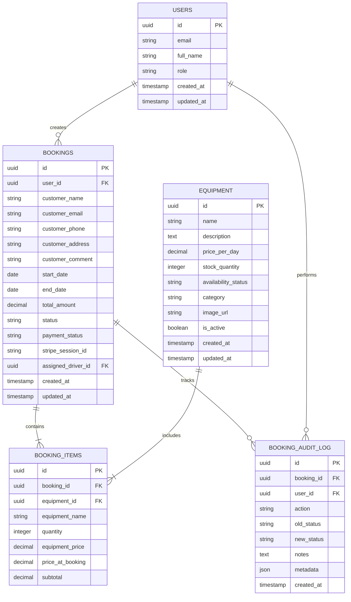

# Book Now Button - Complete Implementation Guide

## 1. Product Overview

This document outlines the comprehensive implementation of a fully functional "Book Now" button system for the Aruba Travel Light booking management platform. The system will provide seamless integration between frontend and backend services, real payment processing, automated notifications, and robust data integrity measures.

## 2. Core Features

### 2.1 User Roles

| Role | Registration Method | Core Permissions |
|------|---------------------|------------------|
| Customer | Email registration | Can create bookings, view booking status |
| Booker | Admin invitation | Can create and manage customer bookings |
| Driver | Admin invitation | Can view assigned deliveries, update delivery status |
| Admin | System admin setup | Full access to all booking management features |

### 2.2 Feature Module

Our Book Now system consists of the following main components:
1. **Booking Form Page**: Equipment selection, date picker, customer information, booking summary
2. **Payment Processing**: Stripe integration, payment confirmation, error handling
3. **Admin Dashboard**: Real-time booking management, status updates, driver assignment
4. **Notification System**: Email confirmations, status updates, delivery notifications
5. **Audit System**: Comprehensive logging, status tracking, data integrity monitoring

### 2.3 Page Details

| Page Name | Module Name | Feature description |
|-----------|-------------|---------------------|
| Booking Form | Equipment Selection | Display available equipment with real-time stock levels, quantity selection, availability status |
| Booking Form | Date Selection | Calendar picker with availability checking, date validation, rental period calculation |
| Booking Form | Customer Information | Form validation for name, email, phone, address with real-time validation |
| Booking Form | Booking Summary | Dynamic pricing calculation, item breakdown, total cost display |
| Booking Form | Payment Integration | Stripe checkout session creation, secure payment processing, payment status handling |
| Admin Dashboard | Booking Management | Real-time booking list, status updates, search and filtering capabilities |
| Admin Dashboard | Driver Assignment | Assign drivers to deliveries, track delivery status, route optimization |
| Admin Dashboard | Inventory Management | Stock level monitoring, equipment availability updates, low stock alerts |
| Payment Success | Confirmation | Booking status update to confirmed, email notification trigger, redirect to success page |
| Payment Error | Error Handling | Booking status update to cancelled, stock restoration, retry payment option |

## 3. Core Process

### Customer Booking Flow
1. Customer selects equipment and dates on booking form
2. System validates availability and calculates pricing
3. Customer enters personal information with real-time validation
4. System creates pending booking and initiates Stripe payment session
5. Customer completes payment through Stripe checkout
6. System confirms booking, sends confirmation email, and updates admin dashboard
7. Admin receives real-time notification of new booking

### Admin Management Flow
1. Admin views real-time booking dashboard with all current bookings
2. Admin can update booking status (confirmed, out for delivery, delivered, completed)
3. System sends automated email notifications for each status change
4. Admin assigns drivers to delivery bookings
5. Drivers receive assignment notifications and can update delivery status
6. All changes are logged for audit trail and data integrity



## 4. User Interface Design

### 4.1 Design Style
- **Primary Color**: #0066CC (Professional blue)
- **Secondary Color**: #10B981 (Success green)
- **Button Style**: Rounded corners (rounded-lg) with subtle shadows
- **Font**: Inter font family for all UI elements
- **Layout Style**: Card-based design with consistent spacing
- **Icons**: Lucide React icons for consistency
- **Animations**: Smooth transitions and loading states

### 4.2 Page Design Overview

| Page Name | Module Name | UI Elements |
|-----------|-------------|-------------|
| Booking Form | Equipment Selection | Dropdown with stock indicators, quantity stepper, availability badges |
| Booking Form | Date Selection | Calendar widget with disabled unavailable dates, date range picker |
| Booking Form | Customer Information | Form fields with real-time validation, error states, success indicators |
| Booking Form | Payment Button | Large prominent button, loading states, disabled states for validation |
| Admin Dashboard | Booking Cards | Status color coding, action buttons, expandable details |
| Admin Dashboard | Real-time Updates | Live status indicators, notification badges, auto-refresh |

### 4.3 Responsiveness
The system is mobile-first responsive with touch-optimized interactions for tablet and mobile devices. Desktop version provides enhanced functionality with keyboard shortcuts and advanced filtering options.

---

# Technical Architecture Document

## 1. Architecture Design



## 2. Technology Description

- **Frontend**: React@18 + TypeScript + Tailwind CSS + shadcn/ui + Vite
- **Backend**: Supabase (Database, Auth, Real-time, Edge Functions)
- **Payment**: Stripe Checkout + Webhooks
- **Email**: Resend API for transactional emails
- **State Management**: React Query + Zustand
- **Validation**: Zod + React Hook Form

## 3. Route Definitions

| Route | Purpose |
|-------|---------|
| /book | Main booking form with equipment selection and payment |
| /payment-success | Payment confirmation and booking finalization |
| /payment-error | Payment failure handling and retry options |
| /admin | Admin dashboard with booking management |
| /admin/bookings | Detailed booking list and management interface |
| /driver-dashboard | Driver interface for delivery management |

## 4. API Definitions

### 4.1 Core Booking APIs

**Create Booking**
```
POST /api/bookings
```

Request:
| Param Name | Param Type | isRequired | Description |
|------------|------------|------------|-------------|
| user_id | string | true | Authenticated user ID |
| start_date | string | true | Booking start date (ISO format) |
| end_date | string | true | Booking end date (ISO format) |
| customer_name | string | true | Customer full name |
| customer_email | string | true | Customer email address |
| customer_phone | string | true | Customer phone number |
| customer_address | string | true | Delivery address |
| items | array | true | Array of booking items with equipment_id and quantity |
| total_amount | number | true | Total booking amount |

Response:
| Param Name | Param Type | Description |
|------------|------------|-------------|
| booking_id | string | Created booking ID |
| status | string | Booking status (pending) |
| payment_url | string | Stripe checkout URL |

**Update Booking Status**
```
PUT /api/bookings/{id}/status
```

Request:
| Param Name | Param Type | isRequired | Description |
|------------|------------|------------|-------------|
| status | string | true | New booking status |
| notes | string | false | Optional status change notes |

Response:
| Param Name | Param Type | Description |
|------------|------------|-------------|
| success | boolean | Status update result |
| booking | object | Updated booking object |

### 4.2 Payment APIs

**Create Payment Session**
```
POST /functions/v1/create-payment-session
```

Request:
| Param Name | Param Type | isRequired | Description |
|------------|------------|------------|-------------|
| booking_id | string | true | Booking ID for payment |
| amount | number | true | Payment amount in cents |
| success_url | string | true | Success redirect URL |
| cancel_url | string | true | Cancel redirect URL |

Response:
| Param Name | Param Type | Description |
|------------|------------|-------------|
| payment_url | string | Stripe checkout session URL |
| session_id | string | Stripe session ID |

**Payment Webhook Handler**
```
POST /functions/v1/stripe-webhook
```

Handles Stripe webhook events for payment completion, failure, and refunds.

### 4.3 Notification APIs

**Send Booking Confirmation**
```
POST /functions/v1/booking-confirmation-email
```

Request:
| Param Name | Param Type | isRequired | Description |
|------------|------------|------------|-------------|
| customer_email | string | true | Customer email |
| booking_details | object | true | Complete booking information |
| payment_amount | number | true | Payment amount |

**Send Status Update**
```
POST /functions/v1/booking-status-update-email
```

Request:
| Param Name | Param Type | isRequired | Description |
|------------|------------|------------|-------------|
| customer_email | string | true | Customer email |
| booking_id | string | true | Booking ID |
| new_status | string | true | Updated status |
| equipment_details | string | true | Equipment list |

## 5. Server Architecture Diagram



## 6. Data Model

### 6.1 Data Model Definition



### 6.2 Data Definition Language

**Bookings Table Enhancement**
```sql
-- Add payment tracking fields
ALTER TABLE bookings ADD COLUMN IF NOT EXISTS payment_status VARCHAR(50) DEFAULT 'pending';
ALTER TABLE bookings ADD COLUMN IF NOT EXISTS stripe_session_id VARCHAR(255);
ALTER TABLE bookings ADD COLUMN IF NOT EXISTS assigned_driver_id UUID REFERENCES auth.users(id);

-- Create index for performance
CREATE INDEX IF NOT EXISTS idx_bookings_payment_status ON bookings(payment_status);
CREATE INDEX IF NOT EXISTS idx_bookings_assigned_driver ON bookings(assigned_driver_id);
CREATE INDEX IF NOT EXISTS idx_bookings_status_date ON bookings(status, start_date);
```

**Booking Audit Log Table**
```sql
-- Create audit log table
CREATE TABLE IF NOT EXISTS booking_audit_log (
    id UUID PRIMARY KEY DEFAULT gen_random_uuid(),
    booking_id UUID NOT NULL REFERENCES bookings(id) ON DELETE CASCADE,
    user_id UUID NOT NULL REFERENCES auth.users(id),
    action VARCHAR(100) NOT NULL,
    old_status VARCHAR(50),
    new_status VARCHAR(50),
    notes TEXT,
    metadata JSONB,
    created_at TIMESTAMP WITH TIME ZONE DEFAULT NOW()
);

-- Create indexes
CREATE INDEX idx_audit_log_booking_id ON booking_audit_log(booking_id);
CREATE INDEX idx_audit_log_user_id ON booking_audit_log(user_id);
CREATE INDEX idx_audit_log_created_at ON booking_audit_log(created_at DESC);
```

**Row Level Security Policies**
```sql
-- Enable RLS
ALTER TABLE booking_audit_log ENABLE ROW LEVEL SECURITY;

-- Policies for audit log
CREATE POLICY "Users can view audit logs for their bookings" ON booking_audit_log
    FOR SELECT USING (
        auth.uid() = user_id OR 
        EXISTS (
            SELECT 1 FROM bookings 
            WHERE bookings.id = booking_audit_log.booking_id 
            AND bookings.user_id = auth.uid()
        )
    );

CREATE POLICY "Authenticated users can insert audit logs" ON booking_audit_log
    FOR INSERT WITH CHECK (auth.uid() = user_id);

-- Grant permissions
GRANT SELECT ON booking_audit_log TO authenticated;
GRANT INSERT ON booking_audit_log TO authenticated;
```

**Equipment Stock Management**
```sql
-- Add stock tracking fields
ALTER TABLE equipment ADD COLUMN IF NOT EXISTS reserved_quantity INTEGER DEFAULT 0;
ALTER TABLE equipment ADD COLUMN IF NOT EXISTS low_stock_threshold INTEGER DEFAULT 5;

-- Create function for stock management
CREATE OR REPLACE FUNCTION update_equipment_stock()
RETURNS TRIGGER AS $$
BEGIN
    -- Update availability status based on stock
    UPDATE equipment 
    SET availability_status = CASE 
        WHEN stock_quantity <= 0 THEN 'Out of Stock'
        WHEN stock_quantity <= low_stock_threshold THEN 'Low Stock'
        ELSE 'Available'
    END
    WHERE id = NEW.equipment_id;
    
    RETURN NEW;
END;
$$ LANGUAGE plpgsql;

-- Create trigger
CREATE TRIGGER trigger_update_equipment_stock
    AFTER INSERT OR UPDATE ON booking_items
    FOR EACH ROW
    EXECUTE FUNCTION update_equipment_stock();
```

---

# Implementation Roadmap

## Phase 1: Core Infrastructure (Week 1-2)

### 1.1 Database Schema Updates
- [ ] Implement booking audit log table
- [ ] Add payment tracking fields to bookings
- [ ] Create stock management triggers
- [ ] Set up proper RLS policies

### 1.2 Stripe Integration
- [ ] Replace mock payment with real Stripe integration
- [ ] Implement webhook handler for payment events
- [ ] Add payment status tracking
- [ ] Create refund handling system

### 1.3 Email Notification System
- [ ] Integrate Resend API for email delivery
- [ ] Create booking confirmation email template
- [ ] Implement status update notifications
- [ ] Add driver assignment notifications

## Phase 2: Enhanced Booking Flow (Week 3-4)

### 2.1 Frontend Enhancements
- [ ] Add real-time form validation
- [ ] Implement loading states and error handling
- [ ] Create payment success/error pages
- [ ] Add booking status tracking for customers

### 2.2 Admin Dashboard Improvements
- [ ] Real-time booking updates using Supabase subscriptions
- [ ] Enhanced filtering and search capabilities
- [ ] Bulk operations for booking management
- [ ] Driver assignment interface

### 2.3 Audit and Logging
- [ ] Implement comprehensive audit logging
- [ ] Add user action tracking
- [ ] Create admin audit trail viewer
- [ ] Set up automated backup procedures

## Phase 3: Production Readiness (Week 5-6)

### 3.1 Security and Performance
- [ ] Implement rate limiting for API endpoints
- [ ] Add input sanitization and validation
- [ ] Set up monitoring and alerting
- [ ] Optimize database queries and indexes

### 3.2 Testing and Quality Assurance
- [ ] Unit tests for critical booking functions
- [ ] Integration tests for payment flow
- [ ] End-to-end testing for complete booking process
- [ ] Load testing for high-traffic scenarios

### 3.3 Deployment and Monitoring
- [ ] Set up production environment variables
- [ ] Configure error tracking and logging
- [ ] Implement health checks and monitoring
- [ ] Create deployment automation

## Success Metrics

- **Booking Completion Rate**: >95% of initiated bookings complete successfully
- **Payment Success Rate**: >98% of payment attempts succeed
- **Email Delivery Rate**: >99% of notification emails delivered
- **Admin Response Time**: <2 seconds for dashboard updates
- **System Uptime**: >99.9% availability
- **Error Rate**: <0.1% of requests result in errors

## Risk Mitigation

- **Payment Failures**: Implement retry logic and manual payment processing
- **Email Delivery Issues**: Backup notification system via SMS
- **Database Downtime**: Implement read replicas and failover procedures
- **High Traffic**: Auto-scaling and load balancing configuration
- **Data Loss**: Automated backups and point-in-time recovery

This comprehensive implementation will transform the Book Now button into a robust, production-ready booking system that provides excellent user experience while maintaining data integrity and system reliability.