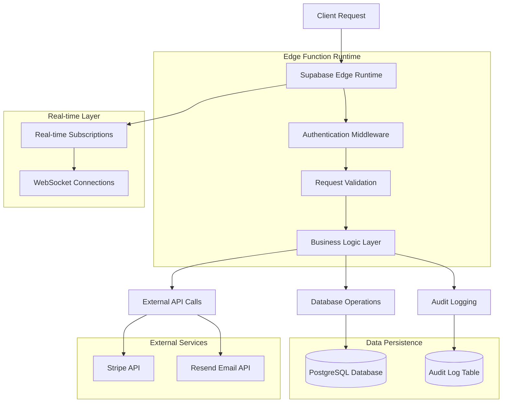
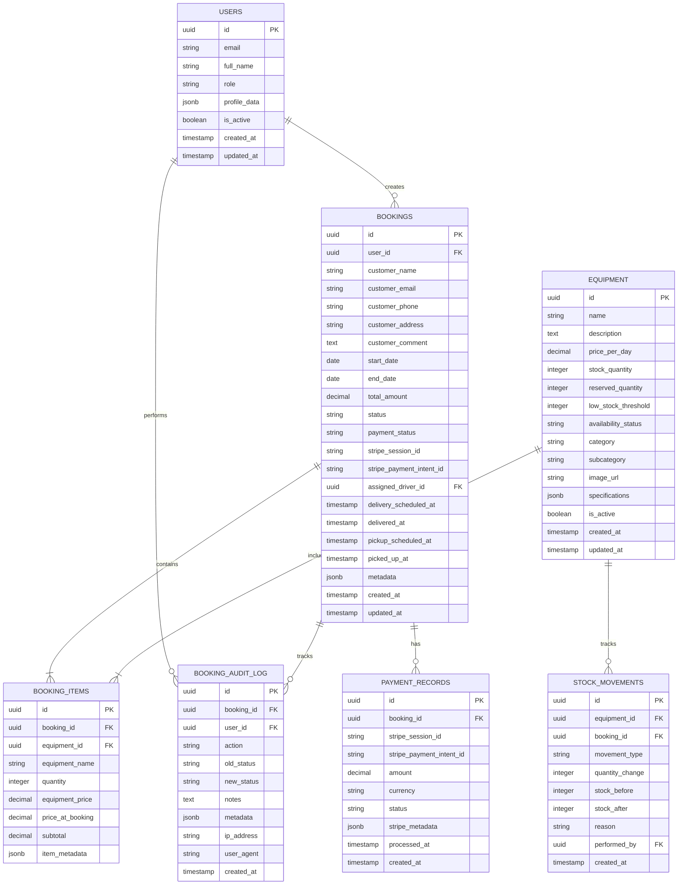

# Book Now Button - Technical Architecture Document

## 1. Architecture Design

```mermaid
graph TD
    A[User Browser] --> B[React Frontend Application]
    B --> C[Supabase Client SDK]
    C --> D[Supabase Database]
    B --> E[Stripe Checkout]
    E --> F[Stripe Webhooks]
    F --> G[Supabase Edge Functions]
    G --> D
    G --> H[Resend Email Service]
    G --> I[Audit Logging System]
    
    subgraph "Frontend Layer"
        B
        J[React Query Cache]
        K[Zustand State Management]
        L[Form Validation (Zod)]
    end
    
    subgraph "Backend Services"
        C
        G
        M[Real-time Subscriptions]
        N[Row Level Security]
    end
    
    subgraph "Data Layer"
        D
        O[Booking Tables]
        P[Audit Log Tables]
        Q[Equipment Inventory]
    end
    
    subgraph "External Services"
        E
        H
        R[Error Monitoring]
    end
```

## 2. Technology Description

- **Frontend**: React@18 + TypeScript + Tailwind CSS + shadcn/ui + Vite
- **State Management**: React Query@4 + Zustand@4
- **Form Handling**: React Hook Form@7 + Zod@3
- **Backend**: Supabase (PostgreSQL + Edge Functions + Real-time)
- **Payment**: Stripe Checkout + Webhooks
- **Email**: Resend API
- **Monitoring**: Sentry for error tracking

## 3. Route Definitions

| Route | Purpose | Components | Auth Required |
|-------|---------|------------|---------------|
| /book | Main booking form | BookingForm, EquipmentSelection, DateSelection | Yes |
| /book?equipmentId={id} | Pre-selected equipment booking | BookingForm (pre-populated) | Yes |
| /payment-success | Payment confirmation | PaymentSuccess, BookingConfirmation | No |
| /payment-error | Payment failure handling | PaymentError, RetryPayment | No |
| /admin/bookings | Booking management | BookingsList, BookingCard | Admin |
| /driver-dashboard | Driver delivery interface | DriverBookings, DeliveryStatus | Driver |

## 4. API Definitions

### 4.1 Frontend API Hooks

**useBooking Hook**
```typescript
interface UseBookingReturn {
  // State
  bookingData: BookingFormData;
  products: Product[];
  isSubmitting: boolean;
  
  // Actions
  updateCustomerInfo: (field: keyof CustomerInfo, value: string) => void;
  updateDates: (field: 'startDate' | 'endDate', value: string) => void;
  submitBooking: (e: React.FormEvent) => Promise<void>;
  calculateTotal: () => number;
  calculateDays: () => number;
}
```

**useBookingManagement Hook (Admin)**
```typescript
interface UseBookingManagementReturn {
  // State
  bookings: Booking[];
  loading: boolean;
  error: string | null;
  
  // Actions
  updateBookingStatus: (id: string, status: BookingStatus) => Promise<void>;
  assignDriver: (bookingId: string, driverId: string) => Promise<void>;
  refetchBookings: () => void;
}
```

### 4.2 Supabase Edge Functions

**Create Payment Session**
```typescript
// /functions/create-payment-session/index.ts
interface PaymentRequest {
  bookingId: string;
  amount: number;
  currency: string;
  successUrl: string;
  cancelUrl: string;
  customerEmail: string;
}

interface PaymentResponse {
  sessionId: string;
  paymentUrl: string;
  expiresAt: string;
}
```

**Stripe Webhook Handler**
```typescript
// /functions/stripe-webhook/index.ts
interface WebhookEvent {
  type: string;
  data: {
    object: {
      id: string;
      payment_status: string;
      metadata: {
        booking_id: string;
      };
    };
  };
}
```

**Booking Confirmation Email**
```typescript
// /functions/booking-confirmation-email/index.ts
interface BookingConfirmationRequest {
  customerEmail: string;
  customerName: string;
  bookingId: string;
  bookingDetails: {
    startDate: string;
    endDate: string;
    equipment: Array<{
      name: string;
      quantity: number;
      price: number;
    }>;
    totalAmount: number;
    deliveryAddress: string;
  };
}
```

### 4.3 Database Queries

**Booking Operations**
```typescript
// Create booking with items
const createBookingWithItems = async (bookingData: CreateBookingData) => {
  const { data: booking, error: bookingError } = await supabase
    .from('bookings')
    .insert(bookingData)
    .select()
    .single();
    
  if (bookingError) throw bookingError;
  
  const { error: itemsError } = await supabase
    .from('booking_items')
    .insert(bookingData.items.map(item => ({
      booking_id: booking.id,
      ...item
    })));
    
  if (itemsError) throw itemsError;
  
  return booking;
};
```

**Real-time Booking Updates**
```typescript
// Subscribe to booking changes
const subscribeToBookingUpdates = (callback: (payload: any) => void) => {
  return supabase
    .channel('booking-updates')
    .on(
      'postgres_changes',
      {
        event: '*',
        schema: 'public',
        table: 'bookings'
      },
      callback
    )
    .subscribe();
};
```

## 5. Server Architecture Diagram



## 6. Data Model

### 6.1 Enhanced Database Schema



### 6.2 Data Definition Language

**Enhanced Bookings Table**
```sql
-- Add comprehensive tracking fields
ALTER TABLE bookings ADD COLUMN IF NOT EXISTS payment_status VARCHAR(50) DEFAULT 'pending';
ALTER TABLE bookings ADD COLUMN IF NOT EXISTS stripe_session_id VARCHAR(255);
ALTER TABLE bookings ADD COLUMN IF NOT EXISTS stripe_payment_intent_id VARCHAR(255);
ALTER TABLE bookings ADD COLUMN IF NOT EXISTS assigned_driver_id UUID REFERENCES auth.users(id);
ALTER TABLE bookings ADD COLUMN IF NOT EXISTS delivery_scheduled_at TIMESTAMP WITH TIME ZONE;
ALTER TABLE bookings ADD COLUMN IF NOT EXISTS delivered_at TIMESTAMP WITH TIME ZONE;
ALTER TABLE bookings ADD COLUMN IF NOT EXISTS pickup_scheduled_at TIMESTAMP WITH TIME ZONE;
ALTER TABLE bookings ADD COLUMN IF NOT EXISTS picked_up_at TIMESTAMP WITH TIME ZONE;
ALTER TABLE bookings ADD COLUMN IF NOT EXISTS metadata JSONB DEFAULT '{}'::jsonb;

-- Create comprehensive indexes
CREATE INDEX IF NOT EXISTS idx_bookings_payment_status ON bookings(payment_status);
CREATE INDEX IF NOT EXISTS idx_bookings_stripe_session ON bookings(stripe_session_id);
CREATE INDEX IF NOT EXISTS idx_bookings_assigned_driver ON bookings(assigned_driver_id);
CREATE INDEX IF NOT EXISTS idx_bookings_status_date ON bookings(status, start_date);
CREATE INDEX IF NOT EXISTS idx_bookings_delivery_schedule ON bookings(delivery_scheduled_at) WHERE delivery_scheduled_at IS NOT NULL;
CREATE INDEX IF NOT EXISTS idx_bookings_metadata ON bookings USING GIN(metadata);
```

**Payment Records Table**
```sql
CREATE TABLE IF NOT EXISTS payment_records (
    id UUID PRIMARY KEY DEFAULT gen_random_uuid(),
    booking_id UUID NOT NULL REFERENCES bookings(id) ON DELETE CASCADE,
    stripe_session_id VARCHAR(255),
    stripe_payment_intent_id VARCHAR(255),
    amount DECIMAL(10,2) NOT NULL,
    currency VARCHAR(3) DEFAULT 'USD',
    status VARCHAR(50) NOT NULL,
    stripe_metadata JSONB DEFAULT '{}'::jsonb,
    processed_at TIMESTAMP WITH TIME ZONE,
    created_at TIMESTAMP WITH TIME ZONE DEFAULT NOW()
);

-- Create indexes
CREATE INDEX idx_payment_records_booking_id ON payment_records(booking_id);
CREATE INDEX idx_payment_records_stripe_session ON payment_records(stripe_session_id);
CREATE INDEX idx_payment_records_status ON payment_records(status);
CREATE UNIQUE INDEX idx_payment_records_stripe_intent ON payment_records(stripe_payment_intent_id) WHERE stripe_payment_intent_id IS NOT NULL;
```

**Stock Movements Table**
```sql
CREATE TABLE IF NOT EXISTS stock_movements (
    id UUID PRIMARY KEY DEFAULT gen_random_uuid(),
    equipment_id UUID NOT NULL REFERENCES equipment(id) ON DELETE CASCADE,
    booking_id UUID REFERENCES bookings(id) ON DELETE SET NULL,
    movement_type VARCHAR(50) NOT NULL, -- 'reservation', 'release', 'adjustment', 'damage', 'maintenance'
    quantity_change INTEGER NOT NULL,
    stock_before INTEGER NOT NULL,
    stock_after INTEGER NOT NULL,
    reason TEXT,
    performed_by UUID REFERENCES auth.users(id),
    created_at TIMESTAMP WITH TIME ZONE DEFAULT NOW()
);

-- Create indexes
CREATE INDEX idx_stock_movements_equipment_id ON stock_movements(equipment_id);
CREATE INDEX idx_stock_movements_booking_id ON stock_movements(booking_id);
CREATE INDEX idx_stock_movements_type ON stock_movements(movement_type);
CREATE INDEX idx_stock_movements_created_at ON stock_movements(created_at DESC);
```

**Enhanced Audit Logging**
```sql
-- Add comprehensive audit fields
ALTER TABLE booking_audit_log ADD COLUMN IF NOT EXISTS ip_address INET;
ALTER TABLE booking_audit_log ADD COLUMN IF NOT EXISTS user_agent TEXT;

-- Create audit trigger function
CREATE OR REPLACE FUNCTION create_booking_audit_log()
RETURNS TRIGGER AS $$
BEGIN
    INSERT INTO booking_audit_log (
        booking_id,
        user_id,
        action,
        old_status,
        new_status,
        metadata
    ) VALUES (
        COALESCE(NEW.id, OLD.id),
        auth.uid(),
        CASE 
            WHEN TG_OP = 'INSERT' THEN 'CREATE'
            WHEN TG_OP = 'UPDATE' THEN 'UPDATE'
            WHEN TG_OP = 'DELETE' THEN 'DELETE'
        END,
        OLD.status,
        NEW.status,
        jsonb_build_object(
            'operation', TG_OP,
            'table', TG_TABLE_NAME,
            'changed_fields', CASE 
                WHEN TG_OP = 'UPDATE' THEN (
                    SELECT jsonb_object_agg(key, value)
                    FROM jsonb_each(to_jsonb(NEW))
                    WHERE value != (to_jsonb(OLD) -> key)
                )
                ELSE NULL
            END
        )
    );
    
    RETURN COALESCE(NEW, OLD);
END;
$$ LANGUAGE plpgsql SECURITY DEFINER;

-- Create audit triggers
CREATE TRIGGER trigger_booking_audit_log
    AFTER INSERT OR UPDATE OR DELETE ON bookings
    FOR EACH ROW
    EXECUTE FUNCTION create_booking_audit_log();
```

**Stock Management Functions**
```sql
-- Function to reserve stock
CREATE OR REPLACE FUNCTION reserve_equipment_stock(
    p_equipment_id UUID,
    p_quantity INTEGER,
    p_booking_id UUID
)
RETURNS BOOLEAN AS $$
DECLARE
    current_stock INTEGER;
    current_reserved INTEGER;
BEGIN
    -- Get current stock levels
    SELECT stock_quantity, reserved_quantity
    INTO current_stock, current_reserved
    FROM equipment
    WHERE id = p_equipment_id
    FOR UPDATE;
    
    -- Check if enough stock available
    IF (current_stock - current_reserved) < p_quantity THEN
        RETURN FALSE;
    END IF;
    
    -- Update reserved quantity
    UPDATE equipment
    SET reserved_quantity = current_reserved + p_quantity
    WHERE id = p_equipment_id;
    
    -- Log stock movement
    INSERT INTO stock_movements (
        equipment_id,
        booking_id,
        movement_type,
        quantity_change,
        stock_before,
        stock_after,
        reason,
        performed_by
    ) VALUES (
        p_equipment_id,
        p_booking_id,
        'reservation',
        p_quantity,
        current_stock - current_reserved,
        current_stock - current_reserved - p_quantity,
        'Equipment reserved for booking',
        auth.uid()
    );
    
    RETURN TRUE;
END;
$$ LANGUAGE plpgsql SECURITY DEFINER;

-- Function to release reserved stock
CREATE OR REPLACE FUNCTION release_equipment_stock(
    p_equipment_id UUID,
    p_quantity INTEGER,
    p_booking_id UUID,
    p_reason TEXT DEFAULT 'Stock released'
)
RETURNS BOOLEAN AS $$
DECLARE
    current_stock INTEGER;
    current_reserved INTEGER;
BEGIN
    -- Get current stock levels
    SELECT stock_quantity, reserved_quantity
    INTO current_stock, current_reserved
    FROM equipment
    WHERE id = p_equipment_id
    FOR UPDATE;
    
    -- Update reserved quantity
    UPDATE equipment
    SET reserved_quantity = GREATEST(0, current_reserved - p_quantity)
    WHERE id = p_equipment_id;
    
    -- Log stock movement
    INSERT INTO stock_movements (
        equipment_id,
        booking_id,
        movement_type,
        quantity_change,
        stock_before,
        stock_after,
        reason,
        performed_by
    ) VALUES (
        p_equipment_id,
        p_booking_id,
        'release',
        -p_quantity,
        current_stock - current_reserved,
        current_stock - GREATEST(0, current_reserved - p_quantity),
        p_reason,
        auth.uid()
    );
    
    RETURN TRUE;
END;
$$ LANGUAGE plpgsql SECURITY DEFINER;
```

**Row Level Security Policies**
```sql
-- Enhanced RLS for bookings
DROP POLICY IF EXISTS "Users can view their own bookings" ON bookings;
CREATE POLICY "Users can view their own bookings" ON bookings
    FOR SELECT USING (
        auth.uid() = user_id OR
        EXISTS (
            SELECT 1 FROM auth.users
            WHERE auth.users.id = auth.uid()
            AND auth.users.raw_user_meta_data->>'role' IN ('admin', 'booker')
        ) OR
        (auth.uid() = assigned_driver_id AND 
         EXISTS (
             SELECT 1 FROM auth.users
             WHERE auth.users.id = auth.uid()
             AND auth.users.raw_user_meta_data->>'role' = 'driver'
         ))
    );

-- RLS for payment records
ALTER TABLE payment_records ENABLE ROW LEVEL SECURITY;

CREATE POLICY "Users can view payment records for their bookings" ON payment_records
    FOR SELECT USING (
        EXISTS (
            SELECT 1 FROM bookings
            WHERE bookings.id = payment_records.booking_id
            AND (
                bookings.user_id = auth.uid() OR
                EXISTS (
                    SELECT 1 FROM auth.users
                    WHERE auth.users.id = auth.uid()
                    AND auth.users.raw_user_meta_data->>'role' IN ('admin', 'booker')
                )
            )
        )
    );

-- RLS for stock movements
ALTER TABLE stock_movements ENABLE ROW LEVEL SECURITY;

CREATE POLICY "Admins can view all stock movements" ON stock_movements
    FOR SELECT USING (
        EXISTS (
            SELECT 1 FROM auth.users
            WHERE auth.users.id = auth.uid()
            AND auth.users.raw_user_meta_data->>'role' = 'admin'
        )
    );

-- Grant appropriate permissions
GRANT SELECT, INSERT ON payment_records TO authenticated;
GRANT SELECT ON stock_movements TO authenticated;
GRANT EXECUTE ON FUNCTION reserve_equipment_stock TO authenticated;
GRANT EXECUTE ON FUNCTION release_equipment_stock TO authenticated;
```

This technical architecture provides a robust foundation for the Book Now button functionality with comprehensive data tracking, audit logging, and real-time capabilities while maintaining security and performance.